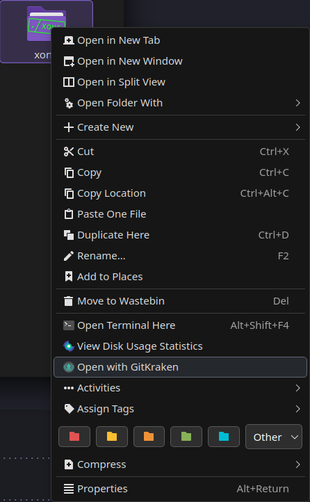

# [Open with GitKraken](https://store.kde.org/p/2348533)

Adding `Open with GitKraken` to the Dolphin context menu.

Based on [Edit/Open with Antigravity](https://github.com/SavageCore/dolphin-service-open-with-antigravity) by me!



## Installation

Either download through Dolphin's Context Menu Settings  
_(Burger menu → Configure → Configure Dolphin → Context Menu → Download New Services → Search for "GitKraken")_

or download the **.desktop** file manually from the [KDE Store](https://store.kde.org/p/2348533) or this GitHub repo, and put it in `~/.local/share/kio/servicemenus/` for Plasma **6**, or `~/.local/share/kservices5/ServiceMenus/` for Plasma **5**.

### Troubleshooting

**If you get "You are not authorized to execute this file" error** or **if the context menu entries don't appear**, make the file executable:

```bash
chmod +x ~/.local/share/kio/servicemenus/open-directory-with-gitkraken.desktop
```

## Credits

Inspired by Hrithik06's [Edit/Open with Zed](https://github.com/Hrithik06/dolphin-service-open-with-zed)
